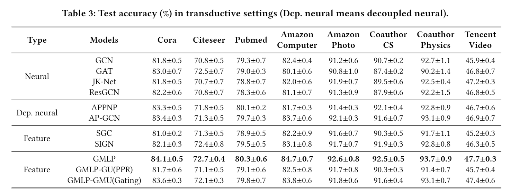
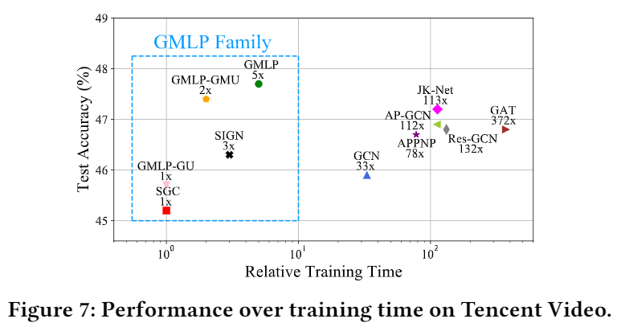
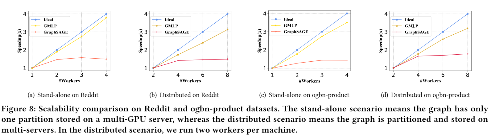

# DeGNN: Characterizing and Improving Graph Neural Networks with Graph Decomposition.

This repository is the official implementation of DeGNN. 

## Requirements

To install requirements:

```setup
pip install -r requirement.txt --user
```


## Training

To train the model(s) in the paper:


>run the ipynb notebook file "test.ipynb" under  directory ‘examples’

>> - input:  the graph file in dir "data"
>>- output:  the test accuracy

## Results

1. Transductive settings:



2. Transductive settings:


3. Efficiency:



4. Scalability:

