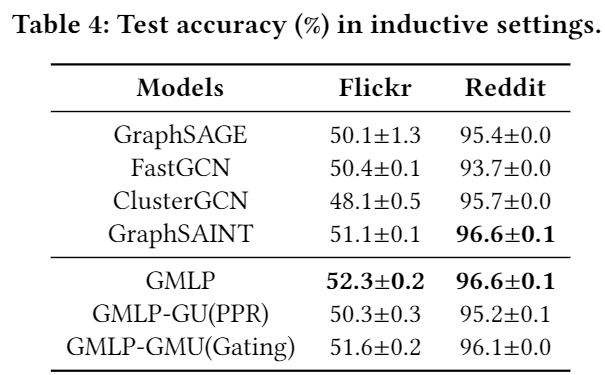
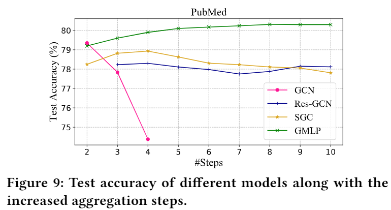

# GMLP: Building Scalable and Flexible Graph Neural Networks with Feature-Message Passing.

This repository is the official implementation of GMLP. 

## Requirements

To install requirements:

```setup
pip install -r requirement.txt --user
```


## Training

To train the model(s) in the paper:

>run the ipynb notebook file "test.ipynb" under  directory ‘examples’

>> - input:  the graph file in dir "data"
>>- output:  the test accuracy

Even with 50 propagation steps, GMLP still keeps a good performance on PunMed!

## Results

1. Transductive settings:


2. Inductive settings:



3. Efficiency:


4. Training scalability:


5. Model scalability:


